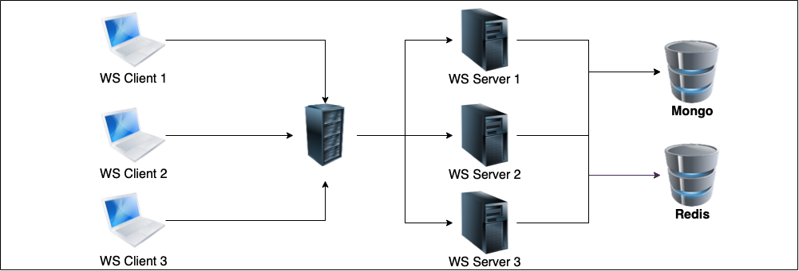
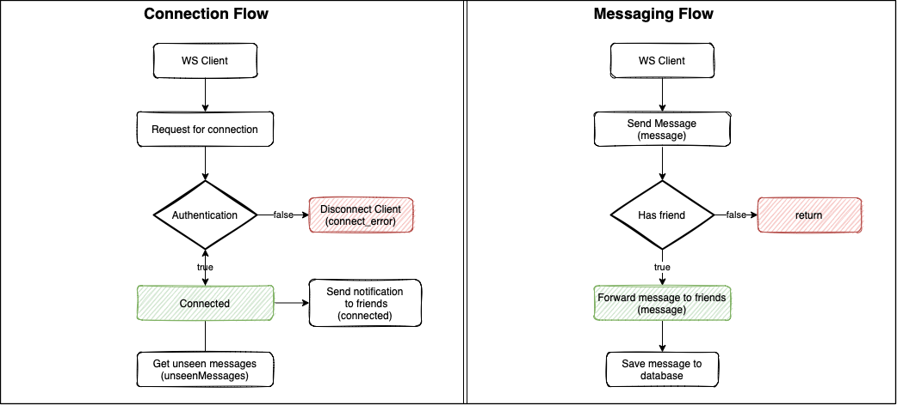

<p align="center">
  <a href="http://nestjs.com/" target="blank"></a>
</p>

# Nestjs Scalable Websocket Example with e2e Testing

Example of scalable dockerized backend using redis, socket.io, mongodb, nginx and including e2e tests. 

<p align="center">
 
</p>

## Features
* Socket connection requires authentication with JWT
* *Connection status* notification is forwarded to all friends of the user.
* Sent messages are forwarded to all friends of the user.
  * ***Messages sent by the user's friends while the user is offline are forwarded when the user is online.*** 
* Application can run on multiple servers

___
***If you wish, you can use the [erenkurnaz/websocket-example-web](https://github.com/erenkurnaz/websocket-example-web) project written in Next.js to test the features with the user interface.***
___

## Event Types
| Event           | message | username | createdAt |
|-----------------|---------|----------|-----------|
| message         | string  | string   | Date      |
| connected       | string  | string   | Date      |
| disconnected    | string  | string   | Date      |
| unseen_messages | string  | string   | Date      |

## Installation and Running the app

```bash
# run the docker-compose file
$ docker-compose up -d
```

> **After docker-compose initialized**
> 
>   1. MongoDb runs on **27017:27017**
>   2. Seed data will be imported 
>   3. Nginx runs on **3000:80**
>   4. Apps runs as server-1, server-2
>   5. Redis runs on **6379**
> 
> *After all, API runs on <a href="http://localhost:3000" target="blank">localhost:3000</a>*

### Seeded Data

| User | Email           | Password(*decoded*) | Name   | Surname   | Friends |
|------|-----------------|---------------------|--------|-----------|---------|
| #1   | obi@mail.com    | 123456              | Obivan | Kenobi    | #2 - #3 |
| #2   | han@mail.com    | 123456              | Han    | Solo      | #1      |
| #3   | anakin@mail.com | 123456              | Anakin | Skywalker | #1      |

## Flowcharts
<p align="center">
 
</p>

## Test

```bash
# Install dependencies 
$ yarn

# e2e tests
$ yarn test:e2e
```

> **Before you test the application make sure docker is up!**
> * ***auth.e2e-spec.ts***
>   - [x] check token sign and verify
>   - [x] check login
> * ***user.e2e-spec.ts***
>   - [x] check user create
>   - [x] check add user to friends
> * ***messages-gateway.e2e-spec.ts***
>   - [x] check unauthorized access
>   - [x] check access with invalid token
>   - [x] should sockets init successfully
>   - [x] check message receive to friends
>   - [x] check disconnected/connected notifications
>   - [x] check receive unseen messages when connected 
